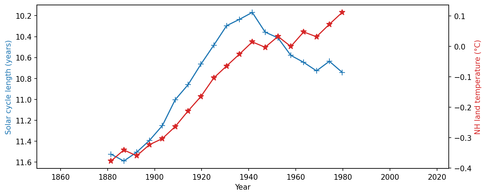

This is the full version of the Correlations scenario from the LilyPad [Are Methods Actionable?](../../lilypads/workflow/methods-actionable/index.qmd). The LilyPad version focuses on what the paper's description leaves ambiguous; here you make all the choices that go into the analysis, including whether the correlation is statistically significant, something the original paper never tested.

## Reproducible, robust, replicable

These words are used in different, sometimes opposite, ways across fields. A helpful way to keep them apart, following [The Turing Way Community (2022)](https://doi.org/10.5281/zenodo.3233853), is to ask whether the data and the analysis are the same as in the original study or different:

| | Same data | Different data |
|---|---|---|
| **Same analysis** | Reproducible | Replicable |
| **Different analysis** | Robust | Generalisable |

The LilyPad version asks whether the result is *reproducible*: can you get it from the paper's description alone? This version goes further. Changing the smoothing, detrending, correlation measure or significance test asks whether the result is *robust* to other reasonable analysis choices. Extending the record to the present asks whether it is *replicable* with data the authors didn't have. (Strictly speaking, all versions use today's datasets rather than the ones available in 1991, which have since been revised.)

::: {.callout-note title="Instructions"}

The goal of the exercise is to determine whether the methods described below are sufficient to reproduce the results shown in Figure 1, and how strongly the conclusions depend on choices the paper leaves open. As you work, take careful notes about what information is missing from the methods section that would help you reproduce the results.

:::


A famous example of how scientifically impactful the details of a workflow can be is the study of [Friis-Christensen & Lassen (1991)](https://doi.org/10.1126/science.254.5032.698), who reported a striking match between the length of the solar cycle and Northern Hemisphere land temperature. Later, [Laut (2003)](https://doi.org/10.1016/S1364-6826(03)00041-5) showed that the result hinged entirely on how the data were processed. In this example, you will tinker with parts of that workflow to understand just how brittle the results are when the workflow is ambiguous.

Here is everything the paper says about how the two series were prepared:

> "[W]e have used the land air temperature for the Northern Hemisphere, expressed as anomalies relative to the interval 1951 to 1980, smoothed by Jones [see (10)]."

> "We determined the length of the sunspot cycle using epochs of maxima and minima found by the secular smoothing procedure introduced by Gleissberg (12) (Fig. 2). This procedure corresponds to the application of a low-pass filter with coefficients 1, 2, 2, 2, 1 to the series of individual sunspot maximum and minimum epochs. This particular filter was selected because it has been generally used in the determination of long-term trends in solar activity, but the use of a different filter would not change the results significantly, as long as the short-term variations related to the 11-year cycle and shorter periods are removed. For the last two extrema, the available data do not allow full smoothing. Therefore, we filtered the second to last extrema by estimating the next extremum (because this is included in the filtering with a weight of one-eighth only); the last extrema express the unfiltered epochs."

> Figure captions: "The symbols (\*) represent average values of the temperature record corresponding to individual solar cycles from solar maximum to solar minimum and from solar minimum to solar maximum, respectively." "Variation of the sunspot cycle length (left-hand scale) determined as the difference between the actual smoothed sunspot extremum and the previous one. The cycle length is plotted at the central time of the actual cycle (+). The unsmoothed last values of the time series have been indicated with a different symbol (\*) which represents, as in Fig. 1, the Northern Hemisphere temperature anomalies."

And here is how the result is reported:

> "Furthermore, a strikingly good agreement between these two curves is revealed. There is a close association between the two curves in the up-going trends from 1900 to 1940 and since 1970, as well as in the important decrease from 1945 to 1970."

The paper gives no quantitative measure of association (e.g. a correlation coefficient) and no test of statistical significance. Figure 1 below re-creates its central figure with today's versions of the data.

{width=75% fig-align="center"}

## Reproducing the analysis

Use the information in these excerpts to reproduce Figure 1 (the match won't be exact but since the claims are qualitative, we are just trying to come as close as we can). Then you'll do what the paper should have done: measure how strong the correlation is and whether it is statistically significant, and see how much those answers depend on choices the paper leaves open. You do not need to know anything about solar physics or statistics for this exercise: each choice is explained below.

The data are fixed for this exercise:

- **Solar activity**: monthly sunspot counts since 1749 from the [Royal Observatory of Belgium](https://www.sidc.be/SILSO/datafiles). The Sun's activity rises and falls in cycles of about 11 years, but some cycles are shorter than others. Friis-Christensen & Lassen used cycle *length* as a measure of solar activity: shorter cycles are interpreted to mean a more active Sun.
- **Temperature**: Northern Hemisphere land temperatures since 1850 from the [CRUTEM5](https://crudata.uea.ac.uk/cru/data/temperature/) dataset, expressed relative to 1951–1980 and, as in the paper, averaged over each half solar cycle (from maximum to minimum and from minimum to maximum). The paper's series was also "smoothed by Jones", which isn't described further, so here you choose how both series are smoothed (choice 1 below).

The cycle lengths sit at the center of each full cycle and the temperature averages at the center of each half cycle, so the two series fall at different times. The paper only compared them by eye. To calculate a correlation, both are interpolated onto the same evenly spaced time steps, about 5.5 years apart.

```{ojs}
//| echo: false

corrManifest = FileAttachment("correlation/images/manifest.json").json()
```

```{ojs}
//| echo: false

corrActivity = {
  const attempts = [];
  let currentAttempt = null;

  const labels = {
    smoothing: {
      "12221": "1-2-2-2-1",
      "lanczos": "Lanczos, 11-year cutoff",
      "none": "None"
    },
    treatment: {
      "original": "Estimate the next extremum",
      "consistent": "Same smoothing throughout"
    },
    period: {
      "1850-1980": "1850–1980",
      "1850-1990": "1850–1990",
      "1850-2025": "1850–present"
    },
    detrend: {
      "none": "None",
      "linear": "Linear"
    },
    statistic: {
      "pearsonr": "Pearson's r",
      "spearmanr": "Spearman's ρ",
      "kendalltau": "Kendall's τ"
    },
    nsim: {
      "20": "20 simulations",
      "50": "50 simulations",
      "200": "200 simulations",
      "1000": "1000 simulations"
    }
  };

  const symbols = {
    "pearsonr": "r",
    "spearmanr": "ρ",
    "kendalltau": "τ"
  };


  const root = html`
    <div>

      <div class="row g-4">

        <!-- LEFT COLUMN -->
        <div class="col-12 col-md-4">

          <h3><strong>Your choices</strong></h3>

          <h4><strong>1. Smoothing</strong></h4>

          <p>
            First, the dates of each sunspot maximum and minimum are found. Cycle lengths are the
            time from one minimum to the next and from one maximum to the next, giving one value
            about every 5.5 years. Temperatures are averaged over each half cycle, between a maximum
            and the next minimum or vice versa. Both series jump around a lot, so they are smoothed,
            here always in the same way:
          </p>

          <ul>
            <li><strong>1-2-2-2-1 (as in the paper):</strong> each value is replaced by a weighted
              average of five consecutive values of the same kind (for cycle lengths, the dates of
              maxima with maxima and minima with minima), with weights 1-2-2-2-1. Each smoothed value
              summarizes about 55 years. This is strong smoothing, and it needs two later values,
              so it raises the question of what to do at the end of the record (below).</li>
            <li><strong>Lanczos, 11-year cutoff:</strong> a standard low-pass filter that removes
              ups and downs shorter than 11 years, applied to both series on yearly steps. It is much
              gentler than 1-2-2-2-1, and it handles the ends of the record on its own.</li>
            <li><strong>None:</strong> the raw cycle lengths and half-cycle temperature averages.</li>
          </ul>

          <div class="mb-4">
            <label class="form-label">Smoothing</label>
            <select class="form-select" id="c-smoothing">
              <option value="12221">1-2-2-2-1 (as in the paper)</option>
              <option value="lanczos">Lanczos, 11-year cutoff</option>
              <option value="none">None</option>
            </select>
          </div>

          <p>
            <strong>End of the record (1-2-2-2-1 only).</strong>
            The most recent values don't have two later values yet, so the full average can't be
            computed there. There are two ways to handle this:
          </p>

          <ul>
            <li><strong>Estimate the next extremum:</strong> what the paper did. The second-to-last
              date is smoothed using a guess for the next, not-yet-observed extremum (the paper
              doesn't say how it was guessed; here it is the last date plus the average cycle length),
              and the last date is left unsmoothed. Temperature is treated as closely as possible
              to this: the next half cycle can't be guessed, so its second-to-last value is averaged
              over the four available values and its last value is left unsmoothed. The curves reach
              the most recent years, but their last points are processed differently from the rest.</li>
            <li><strong>Same smoothing throughout:</strong> drop the values where the full average
              can't be computed. Every point is treated the same way, but the curves stop
              more than a decade earlier.</li>
          </ul>

          <div class="mb-4">
            <label class="form-label">End of the record</label>
            <select class="form-select" id="c-treatment">
              <option value="original">Estimate the next extremum</option>
              <option value="consistent">Same smoothing throughout</option>
            </select>
          </div>


          <h4><strong>2. Time period</strong></h4>

          <p>
            Which years to compare. Data after the end year are ignored, as if the analysis
            had been done in that year, so the end-of-record choice above applies to whichever
            year you stop at. Friis-Christensen & Lassen published in 1991, with data up to
            about 1990. Choosing "present" adds more than three decades of data they didn't have.
          </p>

          <div class="mb-4">
            <label class="form-label">Period</label>
            <select class="form-select" id="c-period">
              <option value="1850-1980">1850–1980</option>
              <option value="1850-1990">1850–1990</option>
              <option value="1850-2025">1850–present</option>
            </select>
          </div>


          <h4><strong>3. Detrending</strong></h4>

          <p>
            Two series that both drift up or down over time will look correlated even if they are
            unrelated: almost any two things that grew over the 20th century "correlate". Here,
            temperatures rose over the period and solar cycles became shorter in the early 1900s.
          </p>

          <p>
            Detrending removes the best-fitting straight line from each series before comparing
            them. That changes the question from "did both change over time?" to "do their ups
            and downs around the long-term trend match?" With <strong>None</strong>, the series are
            compared as they are.
          </p>

          <div class="mb-4">
            <label class="form-label">Detrending method</label>
            <select class="form-select" id="c-detrend">
              <option value="none">None</option>
              <option value="linear">Linear</option>
            </select>
          </div>


          <h4><strong>4. Correlation measure</strong></h4>

          <p>
            There are several ways to measure how closely two series move together. All range from
            −1 (one goes up exactly when the other goes down) to +1 (they move in lockstep), with 0
            meaning no relationship. Here the expected sign is negative: shorter cycles (a more active
            Sun) should go with warmer temperatures.
          </p>

          <ul>
            <li><strong>Pearson's r</strong> measures how well the two follow a straight-line
              relationship. It is the most common choice, but a few extreme values can strongly affect it.</li>
            <li><strong>Spearman's ρ</strong> ("rho") replaces each value by its rank (1st, 2nd, 3rd…)
              and then does the same thing. It only asks whether the two rise and fall together,
              not whether they do so in proportion.</li>
            <li><strong>Kendall's τ</strong> ("tau") compares every pair of years and counts how often
              both series change in the same direction. Its values tend to be smaller than the other
              two for the same data, so the numbers aren't directly comparable across measures.</li>
          </ul>

          <div class="mb-4">
            <label class="form-label">Correlation measure</label>
            <select class="form-select" id="c-statistic">
              <option value="pearsonr">Pearson's r</option>
              <option value="spearmanr">Spearman's ρ</option>
              <option value="kendalltau">Kendall's τ</option>
            </select>
          </div>


          <h4><strong>5. Significance</strong></h4>

          <p>
            Both curves are smooth, and smooth curves can line up by chance far more often than
            jagged ones. To judge whether a correlation could be a fluke, it is compared with
            correlations between random series that resemble the real ones but are unrelated by
            construction. The p-value is the fraction of those random pairs that correlate at least
            as strongly as the real data. Below 0.05 is usually called "significant".
          </p>

          <p>
            Here the random series are made by <strong>phase randomization</strong>, which scrambles
            the timing of each series while keeping its balance of slow and fast variations, so the
            random series are just as smooth as the real ones (see
            <a href="https://linked.earth/PyleoTutorials/notebooks/L1_surrogates.html#non-parametric-surrogates">this Pyleoclim tutorial</a>
            for details).
          </p>

          <p>
            Choose how many random series to generate. In principle, the real correlation
            <em>should</em> be compared with many of them, but how many is a choice, and it affects
            the result. With 20 simulations, for example, the p-value can only take steps of 1/20 = 0.05.
            Try different numbers and see for yourself.
          </p>

          <div class="mb-4">
            <label class="form-label">Number of simulations</label>
            <select class="form-select" id="c-nsim">
              <option value="20">20</option>
              <option value="50">50</option>
              <option value="200">200</option>
              <option value="1000">1000</option>
            </select>
          </div>


          <button
            type="button"
            class="btn btn-primary w-100"
            id="c-generate">
            Generate figure
          </button>

        </div>


        <!-- RIGHT COLUMN -->
        <div class="col-12 col-md-8">

          <h3><strong>Your workflow</strong></h3>

          <div class="callout callout-style-default callout-info">
            <div class="callout-body-container callout-body">
              <p><strong>Smoothing:</strong> <span id="c-summary-smoothing"></span></p>
              <p><strong>End of the record:</strong> <span id="c-summary-treatment"></span></p>
              <p><strong>Time period:</strong> <span id="c-summary-period"></span></p>
              <p><strong>Detrending:</strong> <span id="c-summary-detrend"></span></p>
              <p><strong>Correlation measure:</strong> <span id="c-summary-statistic"></span></p>
              <p><strong>Significance:</strong> phase randomization, <span id="c-summary-nsim"></span></p>
            </div>
          </div>


          <h3 class="mt-4"><strong>Your result</strong></h3>

          <div id="c-result" style="min-height: 250px;">
            <em>Your generated figure will appear here.</em>
          </div>

          <p id="c-attempt-status" class="text-muted mt-2"></p>

        </div>

      </div>


      <hr class="my-5">


      <!-- NOTEPAD -->
      <h2><strong>Notepad</strong></h2>

      <p id="c-notes-label">
        As you work, keep track of information you wish the Methods section had provided.
      </p>

      <textarea
        id="c-notes"
        class="form-control"
        rows="8"
        placeholder="What information is missing? What decisions did you have to make?"
      ></textarea>

      <button
        type="button"
        class="btn btn-primary mt-3"
        id="c-download">
        Download notes
      </button>

      <details id="c-history-container" class="mt-4" hidden>
        <summary><strong>Attempt history</strong></summary>
        <div id="c-history" class="mt-3"></div>
      </details>

    </div>
  `;


  // --------------------------------------------------
  // Get controls
  // --------------------------------------------------

  const keys = ["smoothing", "treatment", "period", "detrend", "statistic", "nsim"];

  const controls = Object.fromEntries(
    keys.map(k => [k, root.querySelector(`#c-${k}`)])
  );

  const result = root.querySelector("#c-result");
  const status = root.querySelector("#c-attempt-status");
  const notes = root.querySelector("#c-notes");
  const notesLabel = root.querySelector("#c-notes-label");
  const historyContainer = root.querySelector("#c-history-container");
  const history = root.querySelector("#c-history");


  // --------------------------------------------------
  // Current workflow and summary
  // --------------------------------------------------

  function getWorkflow() {
    return Object.fromEntries(keys.map(k => [k, controls[k].value]));
  }

  function sameWorkflow(a, b) {
    if (!a || !b) return false;
    return keys.every(k => a[k] === b[k]);
  }

  function label(k, w) {
    if (k === "treatment" && w.smoothing !== "12221") return "(not used)";
    return labels[k][w[k]];
  }

  function describe(w) {
    return keys.map(k => label(k, w)).join(" → ");
  }

  function updateSummary() {
    const workflow = getWorkflow();
    for (const k of keys) {
      root.querySelector(`#c-summary-${k}`).textContent = label(k, workflow);
    }
    updateStatus();
  }

  function updateStatus() {
    if (!currentAttempt) {
      status.textContent = "";
      return;
    }
    status.textContent = sameWorkflow(getWorkflow(), currentAttempt)
      ? `Showing result from Attempt ${currentAttempt.number}.`
      : "Your selections have changed. Click Generate figure to see the new result.";
  }

  function formatResult(match, statistic) {
    const p = match.p === 0 ? "< " + (1 / Number(match.nsim)).toFixed(3) : match.p.toFixed(3);
    return `${symbols[statistic]} = ${match.r.toFixed(2)}, p ${match.p === 0 ? "" : "= "}${p}`;
  }


  // --------------------------------------------------
  // Attempt history
  // --------------------------------------------------

  function renderHistory() {
    history.replaceChildren();

    for (const attempt of attempts) {
      const entry = document.createElement("div");
      entry.className = "border-bottom pb-3 mb-3";

      const title = document.createElement("strong");
      title.textContent = `Attempt ${attempt.number}`;

      const workflow = document.createElement("div");
      workflow.className = "small mt-1";
      workflow.textContent = `${describe(attempt)} → ${attempt.result}`;

      entry.append(title, workflow);

      if (attempt.notes.trim()) {
        const note = document.createElement("div");
        note.className = "small mt-2";
        note.textContent = `Notes: ${attempt.notes}`;
        entry.appendChild(note);
      }

      history.appendChild(entry);
    }

    historyContainer.hidden = attempts.length === 0;
  }


  // --------------------------------------------------
  // Generate figure
  // --------------------------------------------------

  root.querySelector("#c-generate").addEventListener("click", () => {

    if (currentAttempt) currentAttempt.notes = notes.value;

    const workflow = getWorkflow();
    const match = corrManifest.find(d => keys.every(k => d[k] === workflow[k]));

    if (!match) {
      result.innerHTML =
        `<div class="alert alert-warning">
           No precomputed result was found for this workflow.
         </div>`;
      return;
    }

    const resultText = formatResult(match, workflow.statistic);

    // First notes entered before generating belong to Attempt 1.
    const attempt = {
      number: attempts.length + 1,
      ...workflow,
      result: resultText,
      notes: attempts.length === 0 ? notes.value : ""
    };

    attempts.push(attempt);
    currentAttempt = attempt;

    if (attempt.number > 1) notes.value = "";

    // Display figure and numbers
    result.replaceChildren();

    const img = document.createElement("img");
    img.src = match.image;
    img.alt = `Generated figure for Attempt ${attempt.number}`;
    img.style.width = "100%";
    img.style.height = "auto";

    const numbers = document.createElement("p");
    numbers.className = "mt-2";
    numbers.innerHTML =
      `<strong>${resultText}</strong> ` +
      `(${match.significant ? "significant" : "not significant"} at the 5% level). ` +
      `<span class="text-muted">Years compared: ${match.window} (${match.n} values).</span>`;

    result.append(img, numbers);

    notesLabel.textContent =
      `Notes for Attempt ${attempt.number}: ` +
      "record what you observe and what information you wish had been provided.";

    renderHistory();
    updateStatus();
  });


  // --------------------------------------------------
  // Continuously save current notes
  // --------------------------------------------------

  notes.addEventListener("input", () => {
    if (currentAttempt) currentAttempt.notes = notes.value;
  });


  // --------------------------------------------------
  // Download notes + attempts
  // --------------------------------------------------

  root.querySelector("#c-download").addEventListener("click", () => {

    if (currentAttempt) currentAttempt.notes = notes.value;

    let output =
      "ARE METHODS ACTIONABLE?\n" +
      "Workflow reproduction exercise: Correlations\n" +
      "========================================\n\n";

    if (attempts.length === 0) {
      output += "No figures were generated.\n\n";
      if (notes.value.trim()) output += "NOTES\n" + notes.value.trim() + "\n";
    } else {
      for (const attempt of attempts) {
        output += `ATTEMPT ${attempt.number}\n`;
        output += "----------------------------------------\n";
        output += `Smoothing: ${labels.smoothing[attempt.smoothing]}\n`;
        output += `End of the record: ${attempt.smoothing === "12221" ? labels.treatment[attempt.treatment] : "(not used)"}\n`;
        output += `Time period: ${labels.period[attempt.period]}\n`;
        output += `Detrending: ${labels.detrend[attempt.detrend]}\n`;
        output += `Correlation measure: ${labels.statistic[attempt.statistic]}\n`;
        output += `Significance: phase randomization, ${labels.nsim[attempt.nsim]}\n`;
        output += `Result: ${attempt.result}\n\n`;
        output += "Notes:\n";
        output += attempt.notes.trim() ? attempt.notes.trim() : "(No notes recorded)";
        output += "\n\n========================================\n\n";
      }
    }

    const blob = new Blob([output], {type: "text/plain;charset=utf-8"});
    const url = URL.createObjectURL(blob);
    const link = document.createElement("a");
    link.href = url;
    link.download = "correlation-reproduction-notes.txt";
    document.body.appendChild(link);
    link.click();
    link.remove();
    URL.revokeObjectURL(url);
  });


  // --------------------------------------------------
  // Control listeners and initial state
  // --------------------------------------------------

  for (const k of keys) controls[k].addEventListener("change", updateSummary);

  // The end-of-record choice only applies to 1-2-2-2-1 smoothing
  function updateTreatment() {
    controls.treatment.disabled = controls.smoothing.value !== "12221";
  }
  controls.smoothing.addEventListener("change", updateTreatment);

  updateTreatment();
  updateSummary();

  return root;
}
```
