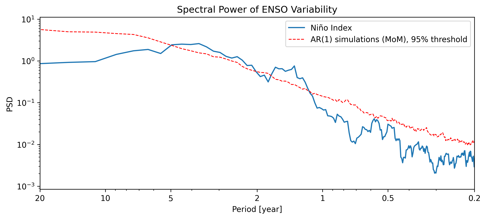

## Can you reproduce this result?

::: {.callout-note title="Methods"}
We examined interannual variability in the El Niño Southern Oscillation (ENSO) using spectral analysis. Results of this analysis are shown in Figure 1.
:::

{width=75% fig-align="center"}

## Reproduce the analysis

Use the information provided in the Methods section to reproduce Figure 1.

::: {.grid}

::: {.g-col-12 .g-col-md-6}
### 1. Choose the data

```{ojs}
//| echo: false

viewof enso_index = Inputs.select(
  ["Niño 3", "Niño 3.4", "Niño 4"],
  {
    label: "ENSO index",
    value: "Niño 3"
  }
)
```
:::

::: {.g-col-12 .g-col-md-6}
### 2. Detrending

```{ojs}
//| echo: false

viewof detrend = Inputs.select(
  ["None", "Linear", "Constant", "Savitzky-Golay", "EMD"],
  {
    label: "Detrending method",
    value: "Linear"
  }
)
```
:::

::: {.g-col-12 .g-col-md-6}
### 3. Interpolation

```{ojs}
//| echo: false

viewof interpolation = Inputs.select(
  ["None", "Linear", "Cubic spline"],
  {
    label: "Interpolation method",
    value: "None"
  }
)
```
:::

::: {.g-col-12 .g-col-md-6}
### 4. Standardization

```{ojs}
//| echo: false

viewof standardize = Inputs.toggle({
  label: "Standardize the time series",
  value: false
})
```
:::

:::

### 5. Spectral analysis

```{ojs}
//| echo: false

spectral_options =
  interpolation === "None"
    ? ["Lomb–Scargle"]
    : ["Fourier", "MTM", "Lomb–Scargle"]

viewof spectral_method = Inputs.select(
  spectral_options,
  {
    label: "Spectral method",
    value: spectral_options.includes("MTM") ? "MTM" : "Lomb–Scargle"
  }
)
```

### 6. Significance testing

```{ojs}
//| echo: false

viewof significance = Inputs.select(
  ["None", "100", "250", "500"],
  {
    label: "Monte Carlo simulations",
    value: "None"
  }
)
```

### Your workflow

```{ojs}
//| echo: false

html`
<div class="callout callout-style-default callout-info">
  <div class="callout-body-container callout-body">
    <p><strong>Data:</strong> ${enso_index}</p>
    <p><strong>Detrending:</strong> ${detrend}</p>
    <p><strong>Interpolation:</strong> ${interpolation}</p>
    <p><strong>Standardization:</strong> ${standardize ? "Yes" : "No"}</p>
    <p><strong>Spectral method:</strong> ${spectral_method}</p>
    <p><strong>Significance:</strong> ${significance === "None" ? "None" : significance + " simulations"}</p>
  </div>
</div>
`
```